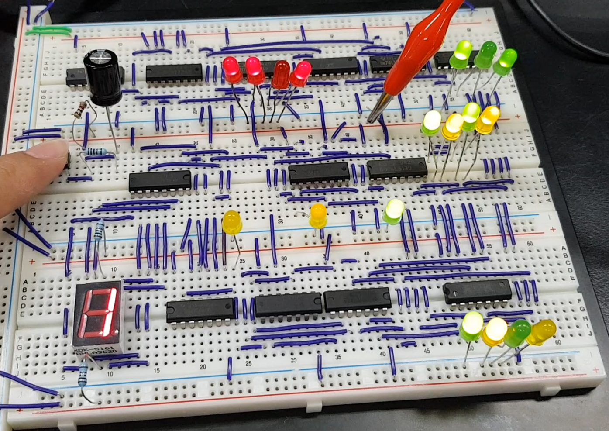
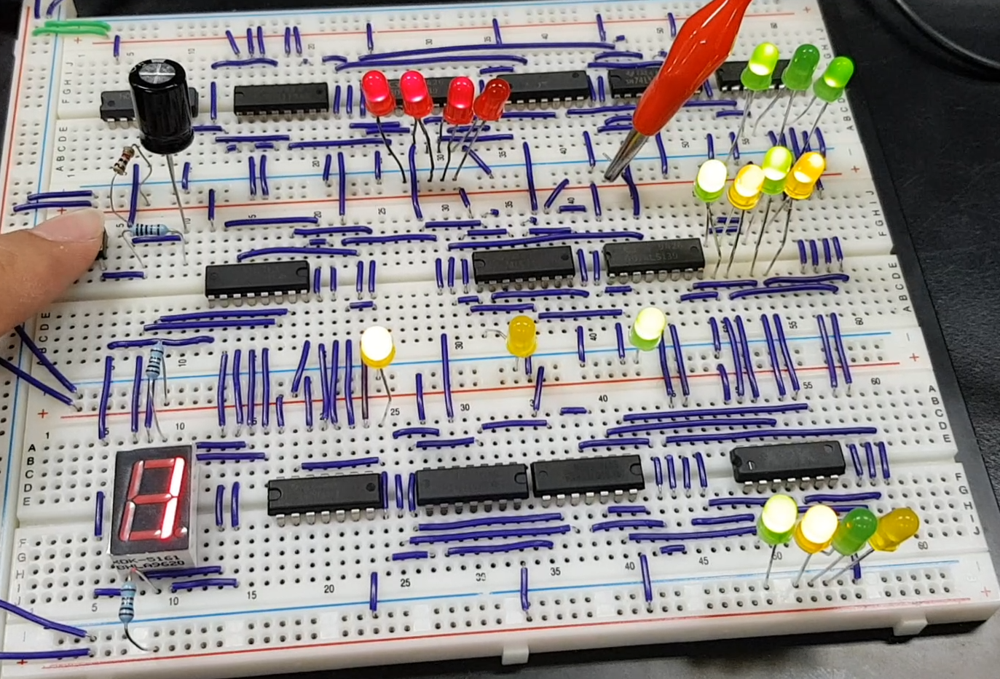

# DigitalSystemGame
此次專題是一個有趣的配對燈小遊戲，透過不同IC組合成的實作實驗。

## Introduction
在此次遊戲中，麵包版上會有4顆紅色燈泡，分別代表不同的狀態，並且會有兩排各4顆黃綠燈交錯的燈泡，每相鄰的黃綠兩顆燈泡代表為一組，當紅色燈的第一顆熄滅時代表目前遊戲開始，初始化燈泡，第二顆熄滅時，板上兩排的黃色燈泡會輪流一顆熄滅著，當玩家按完按紐後就會決定是哪顆黃色熄滅，第三顆紅燈熄滅時，代表我們要選擇一顆綠燈熄滅，綠燈也會跟剛才黃燈的模式一樣輪流一顆熄滅，玩家決定哪顆綠燈熄滅，第四顆紅燈熄滅時，如果熄滅的綠燈剛好是跟熄滅的黃燈同一組的話，那麼分數板旁邊的黃色燈泡就會亮著，這樣就代表得分，如果不同組就不會得分，並且黃燈也不會亮著， 在一旁的電容是為了不要讓按紐在短時間內可能會重複按下而設計出的防止方法。

## Getting Started
在上述說明中可以得知這個遊戲的四階段分別為: 初始化跟計算分數、選定黃燈、選定對應的綠燈、判定遊戲結果。
我們利用按鈕、JK正反器配合74139(2對4解多工)對不同階段的變化進行燈泡的改變，	因為使用的是74139，所以被選定的階段輸出0，因此選定的燈泡會是暗的。當按鈕按下，JK正反器的數值會變動一次，按鈕會接CLK1，CLK2接Q1，其他值(J1、K1、J2、K2 、CLR1、CLR2、PR1、PR2)為1，數值會照(Q1-Q2)進行變動，最後傳入74139，然後上面的說明也有說到電容的功用，配合7414，就是為了穩定按鈕，穩定整個訊號。

### 階段一
輸出會接到控制黃綠燈的JK的CLR並讓PR都為1，目的就是讓黃綠燈後不會因為交流電而改變它的數值。

### 階段二
輸出會先接到NOT後再接到JK的JK，這時候它的CLR為1，並且這個JK的Q1-Q2會被送進74139進行處理，讓Q1-Q2選擇的那個燈泡變成0，就是讓它熄滅，然後由交流電的引響下輪流讓黃色燈泡熄滅。

### 階段三
原理也是和階段二差不多的，利用Q1-Q2的值進入74139並且藉由交流電，以達到輪流讓綠色的燈熄滅的效果。

### 階段四
所有燈泡會做XOR來看燈泡亮的是否有不一樣，再接OR當判斷的輸出。第四階段的輸出先經過NOT再和這個輸出做AND才去判斷這次會不會得分。

第四階段跳回第一階段的瞬間，顯示是否得分的黃色燈泡會歸0，如果原本是1，那麼它將會進行加分。
### Hardware

### Circuit Diagram

## Results & Demo
- 第二顆紅燈熄滅，下圖代表的是正在選擇哪顆黃燈熄滅。

- 第三顆紅燈熄滅，下圖代表的是正在選擇哪顆綠燈熄滅。

- 第四顆紅燈熄滅，下圖代表的是沒有配對到，因此分數板旁邊的黃色燈泡就不會亮。

  

- 下圖代表的是有配對到，因此分數板旁邊的黃色燈泡就會亮著。

  